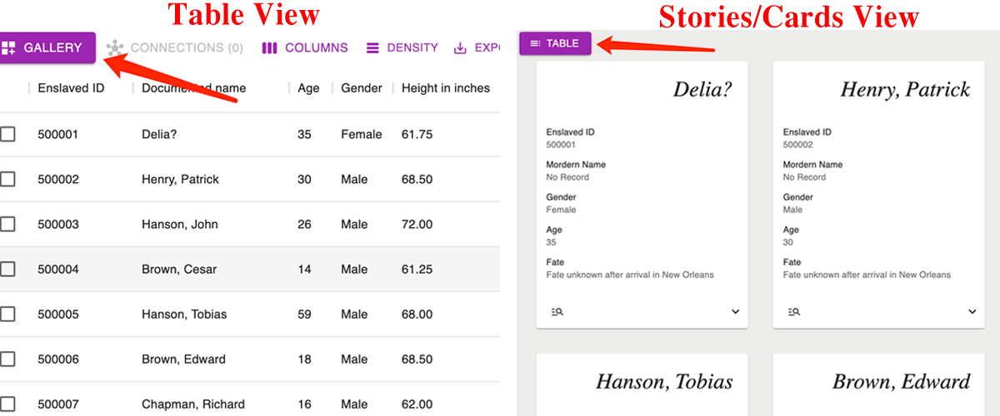

# OverView

Cards are universal component throughout the apps, adopted and serve as another way of visualization on individual's infomation (including enslavers and enslaved people), providing fast look-through into database.

User could switch between two view modes by buttons.




## Features

The card components is based on [Matterial-UI/Cards ](https://mui.com/material-ui/react-card/), contains content reorgnizing and provides features:

- Key info display
- Multi-platform flex display support
- Pignation navigation support
- Detail info extension(optional)
- Sankey/Network Modal remote control(optional)


## Package importing

Cards need support from Lodash for data processing and Material-UI for display support:

- npm install

> npm i -g npm 

- In-file importing

```javascript
import { Button, Card, CardHeader, CardContent, Grid } from "@mui/material";
import { styled } from '@mui/material/styles';
import _ from 'lodash';
```


## Styling Modification

Card Styles are modified by both local file and customizable Material-UI sytle endpoints.

- Card overall

```css
/*supposed to add in local css file:*/
@media (min-width: 800px){
  .enslaved_story{
    height: "100%";
  }
  .enslaver_story_func_head{
    height: 4em;
  }
}

.storybackground{
  background-color: #ececea	;
}
```


- `Material UI { Style }` 

```javascript
/*In javascript*/
const Div = styled('div')(({ theme }) => ({
  ...theme.typography.overline,
  backgroundColor: theme.palette.background.paper,
  padding: theme.spacing(1),
}));

const ExpandMore = styled((props) => {
  const { expand, ...other } = props;
  return <ExpandMoreIcon {...other} />;
})(({ theme, expand }) => ({
  transform: !expand ? 'rotate(0deg)' : 'rotate(180deg)',
  marginLeft: 'auto',
  transition: theme.transitions.create('transform', {
    duration: theme.transitions.duration.shortest,
  }),
}));
```


- Flexible box

```react
<Grid container spacing={{ xs: 6, md: 4, lg:5}} padding={{ xs: 4, md: 3, lg:4 }}>
  <Grid item xs={12} sm={6} md={4} lg={3}>
    <DIY Component />
  </Grid>
</Grid>
```


## Props


| Prop          | Type                      | Default | Description                                                  |
| ------------- | ------------------------- | ------- | :----------------------------------------------------------- |
| target | Object                    |         | The enslaver/enslaved_people object that contains attributes |
| dynamic       | boolean                   | false   | This decides if the card is simple or extendable with ExpandIcon |
| canRemote     | boolean                   | false   | This decides if the card could call outside funcitons and displays ManageSearch icon |
| Dataset       | Number                    |         | According to SlaveVoyage database archive, Story.js will disable ManageSearch icon and hide it when it's dataset 0 (TRANS-ATLANTIC) |
| remoteControl | Function                  |         | Function called when clicking the ManageSearch icon, to   switch on the Sankey/Network/Story modal |
| dataChange    | Function                  |         | Function called when clicking the ManageSearch icon, to   reset the `selectedData` useState in the EnslavedApp/EnslaverApp |
| slavery | String(enslaved/enslaver) | | Story.js will do different content processing of target |

## Warning: Each child in a list should have a unique "key" prop

This warning might appear when multiple `< Story />`components are mapped and rendered out of data collections. 

To remove this warning, appending additional `key` attribute to `<Story />` would be a solid solution

- adopting `index` if there's only one-layer of mapping.

```javascript
/* JSX return slots*/
  {collections.map((item, index)) => {
    return <Story key={index} target={item} ... />
  }}
/* JSX return slots*/
```

- adoping unique attribute in `target` .

```javascript
/* JSX return slots*/
  {collections.map(item => {
    return <Story key={item.id} target={item} ... />
  }}
/* JSX return slots*/
```

- For multi-layer mapping, making random number generator is also an approach. For example, [UUID](https://www.npmjs.com/package/uuid) ,which is also npm supported

```javascript
/* JSX return slots*/
  {collections.map((item) => {
    return <Story key={SomeLibrary.generateUniqueID()}  .../> })}
/* JSX return slots*/
```

   
