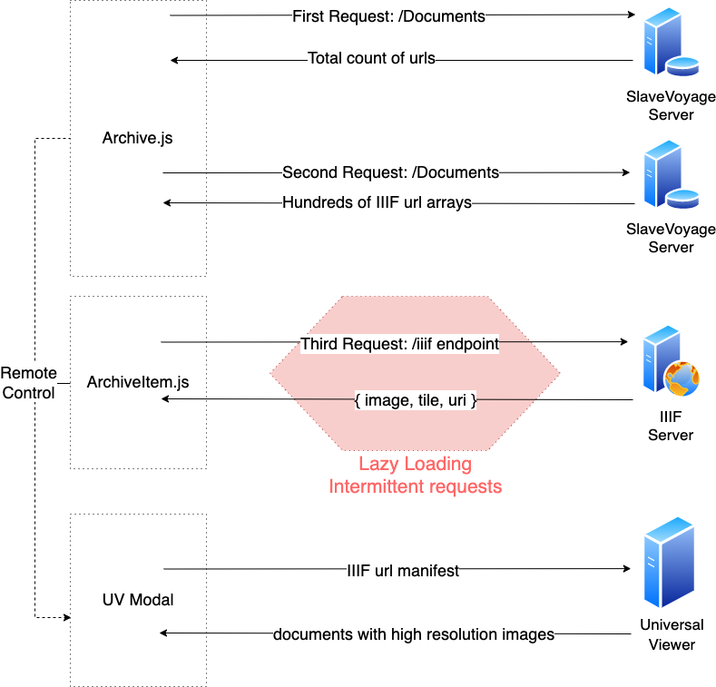

# Overview

Documents are used to provide deep insight into SlaveVoyage archives


&nbsp;

## Features

- Capable of fetching and presenting [IIIF](https://iiif.io/) pictures
- Integrated [Universal Viewer](https://universalviewer.io/) with SlaveVoyage's React framework
- Handling with [IIIF API 3.0's](https://iiif.io/api/image/3.0/) squaring pre-process for uniformed photo size
- Responsive flexbox layouts for devices of different screen size
- LazyLoading in multi-round api fetching to lift application performance


&nbsp;

## Package Importing

- Universal Viewer for IIIF document support

```javascript
npm install universalviewer --save

/*To Use:*/
import "universalviewer/dist/esm/index.css";
import { init } from "universalviewer";
```

- [Lazy Loading](https://github.com/Aljullu/react-lazy-load-image-component) package import

```javascript
npm i --save react-lazy-load-image-component

/*To Use:*/
import {
  LazyLoadImage,
  trackWindowScroll
} from "react-lazy-load-image-component";
import "react-lazy-load-image-component/src/effects/opacity.css";
```


&nbsp;

## Data fetching

- Overall 3 rounds of api requests are called on different servers to finish thumbnail gallery rendering

- Extra 1 round of UniversalViewer manifest feeding is executed to get document details




&nbsp;

## Universal Viewer config

Due to inactivity in open-source maintenance, importing default css from universalviewer will lead to render disorder. We've reorganized UV component and warp it with Modal, for poping-up use.

```javascript
function useUniversalViewer(ref, options) {
    const [uv, setUv] = useState();
  
    useLayoutEffect(() => {
      const currentUv = init(ref.current, options);
      setUv(currentUv);
  
      return () => {
        currentUv.dispose();
      };
    }, []);
  
    return uv;
  }

const UV = ({ manifest, parentWidth }) => {
  const el = useRef();
  const viewer = useUniversalViewer(
    el,
    {
      manifest,
    }
  );
  return <div ref={el} 
          className="uv" 
          style={{
            width: "50vw",
            height: "50vh"
          }}
          />;
};
```


&nbsp;

## <a id="LazyLoading_Document">LazyLoading Wrapping</a>

By warpping each `ArchiveItem` with `trackWindowScroll` , all photoes are anchored with accurate screen coordinate. 

In this way, our application can keep track of users' "view region" thus will only send new fetch requests to backend when the screen is to leave the last region boundry.

```javascript
/*external calling code in Archive.js*/
{apiUrl.map((item,index) => {
	return <ArchiveItem scrollPosition={window.scrollY}/>
})}
            
/*internal interface exposure*/
function ArchiveItem(props){
  const { scrollPosition, ....} = props
  return ...
}
export default trackWindowScroll(ArchiveItem);
```

we also use LayLoading on other structures, see [LazyLoading_In_Methods](../../Methods/Lazy_Loading/)

&nbsp;

## Props

| Prop           | Type     | Default | Description                                                  |
| -------------- | -------- | ------- | ------------------------------------------------------------ |
| handleOpen     | Function |         | Functions to be called after clicking the thumbnail text links. It will switch on the UV modal for high resolution picture manifest fetching |
| iifUrl         | String   |         | Link that UV modal need as a manifest for next-step IIIF endpoint communication |
| scrollPosition | Object   |         | Object containing coordiate information with the curent window scroll position. **Required**. |

