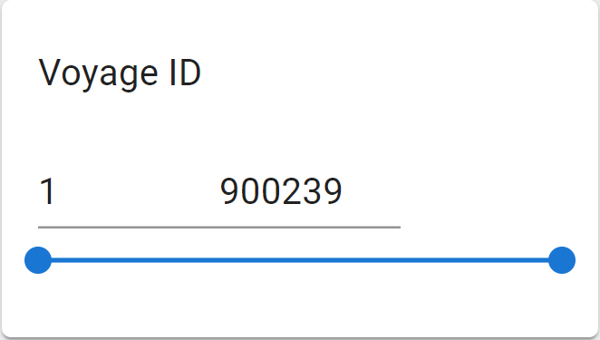
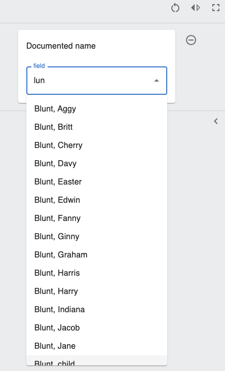
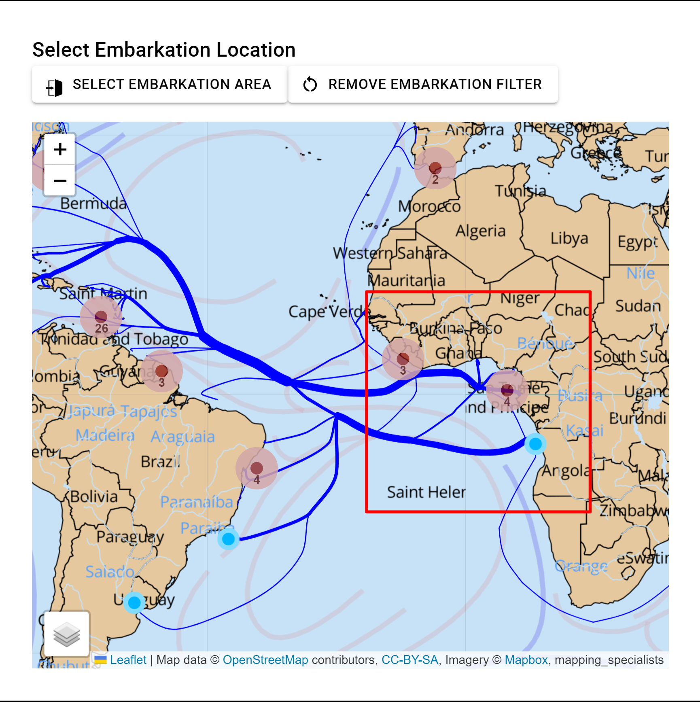

# Filter

&nbsp;

## Overview
The Filter is used to filter the result based on user selection. Users can filter on variables of different types including numberic, text, or visual filters. For each type of variable, there are different filter components including range sliders, multi-selections with autocomplete, and bounding boxes on the map. These filters will carry along in the Voyage app and Past app and affect other components. This page will introduce these filters extensively.

&nbsp;

## Range Slider

The Range Slider is used for selecting value ranges for numberic values. The component uses MUI components `Slider` and `Input` and support features including: 

- setting the default range as minimum and maximum values of the variable selected
- drag the slider to change the range
- click on the slider bar to change the range
- enter values in the input boxes to change the range
- adjust the value to minimum or maximum when the value entered in the input box is out of range

An example Range Slider component looks like following: 




### External Component Used 
- [MUI Slider](https://mui.com/material-ui/api/slider/): slider component from Material-UI library
- [MUI Input](https://mui.com/material-ui/api/input/): input box component from Material-UI library


### Functions
|  Name     |   Functionality  |
| -------   |  --------------- |
|  GetSlider                |   Render range slider component based on the varibale selected       |
|  handleCommittedChange    |   Set the value when user drags the slider, update filter object |
|  handleChange             |   Set the value when user clicks on the slider bar  |
|  handleBlur               |   Handle the situation when the input value is out of range, update filter object |

&nbsp;

## Auto Complete

### Overview
The Autocomplete component is used for making suggestions of search terms based on the current user input. It is used both at the past/ and voyage/ endpoint

The Autocomplete component support features including: 

- selecting multiple values from the autocomplete dropdown menu. 
- deleting selection or modifying text input 
- matching unusual characters like "ç"
- Update results based on the value of other filter components
- ambiguous matching

An example of Auto Complete:



&nbsp;

### External Package Used
- [Material UI](https://mui.com)

&nbsp;

### Functions
|  Name     |   Functionality  |
| -------   |  --------------- |
| endpoint   |  Switch between past/ and voyage/ endpoint for fetch requests  |
| fetchData    |  Post request for fetching autocomplete dropdown menu options           |
| onChange    |  Resets search object each time user input is changed   |
| renderInput    | Displays user input in the search box and updates textInput for post request |

&nbsp;

## Bounding Box
### Overview
The Bounding Box component is used for selecting a certain area on the map in which the voyages begin or end. It is used only in /voyage endpoint. 

The component support features including:
- select a box on the map to filter the voyages that begin or end in the area
- reset the selection

An example of the bounding box looks like the following:


### External Package Used
- [leaflet-area-select](https://github.com/w8r/leaflet-area-select): select the area on the map
- [MapContainer](https://react-leaflet.js.org/docs/api-map/) from React-Leaflet: container that holds the map
- [TileLayer, LayersControl](https://react-leaflet.js.org/docs/api-components/) from React-Leaflet: controls the different layers in the map

### Functions
|  Name         |   Functionality  |
| -------       |  --------------- |
| resetBox      |  Reset the selected box by removing corresponding key-value pairs in filter object |
| AreaSelect    |  Set the filter object after the box is drawn on the map |

### Overview
The Autocomplete component is used for making suggestions of search terms based on the current user input. It is used both at the past/ and voyage/ endpoint

## Component Factory
### Overview
Whenenver a filter component is selected, the ComponentFac function switches between serving different components (such as the slider or the autocomplete function) by checking the type of the flatlabel of the selected option(s).


## Directory
```
src
|
|___CommonComponent
|   |
|   |___Filter
|       |___Autocomplete.js
|       |___Slider.js
|       |___ComponentFac.js
|
|___Component
    |___AreaSelect.jsx
    |___BoundingBoxFilter.js
```


