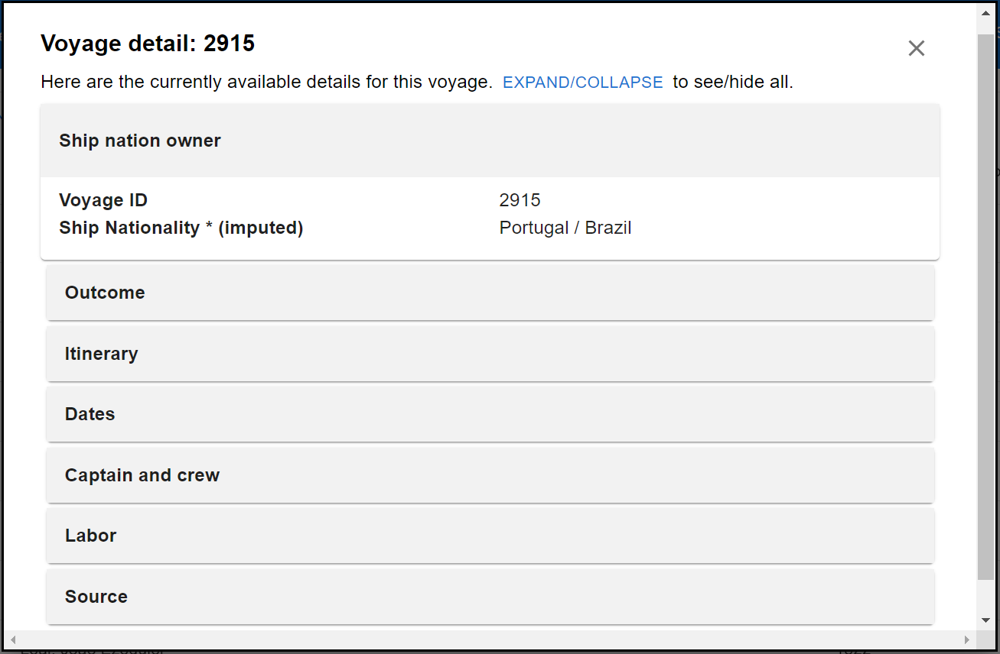

# Modal

## Overview

The Modal component is an interface for visualizing voyage data and is used at the table component 
in both /voyage and /past endpoint.

It employs MUI `Modal` and `Accordion` as the main components.

An example Voyage Modal component looks like following: 



&nbsp;
## Packages Used 
- [MUI Modal](https://mui.com/material-ui/api/modal/) 
- [MUI Accordion](https://mui.com/material-ui/api/accordion/)

&nbsp;
## Props

|  Parameter Names | Functionality  |
| -------   |  --------------- |
| voyageOpen    |  Specify whether to render the voyage modal in front of the webpage |
| setVoyageOpen |  Set the boolean value of voyageOpen |
| voyageId       |  Specify the voyage ID to open the corresponding modal  |
| setUVOpen       |   Set the boolean value of UVOpen |
| setUrl       |   Set the value of url  |


&nbsp;

## Customization
- The style of the modal can be set in `modalStyle` in the file.
- The MUI Accordion is rewritten to support expanding either single or multiple items. 


&nbsp;
## Directory
The following directory shows all files related to Modal. 
```
src
|
|___CommonComponent
    |
    |___VoyageModal.js
```